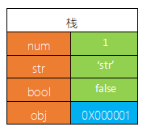
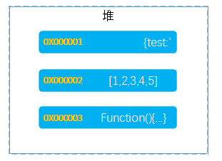
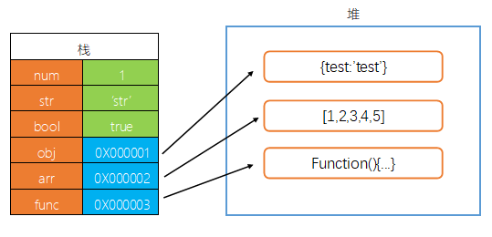
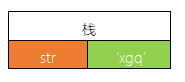
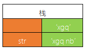
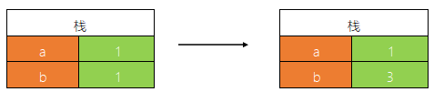
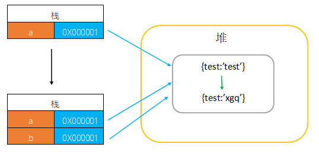

想真正理解**基本类型**和**对象类型**的区别，就要先理解 `堆` 和 `栈` 这两个概念。

### 栈

- 存储的值大小固定
- 空间较小
- 可以直接操作其保存的变量，运行效率高
- 由系统自动分配存储空间

当我们声明了一个变量，并储存基本类型时，就会直接将值存放在栈中。但是如果储存的是对象类型时，它不会储存整个对象，而是储存对象的地址，通过地址来找到数据内容。



### 堆

- 存储的值大小不定，可动态调整
- 空间较大，运行效率低
- 无法直接操作其内部存储，使用引用地址读取
- 通过代码进行分配空间



### 区分原始类型和对象类型的是什么

1. **区别 1：引用方式**
   :::tip
   原始类型的值存放在 `栈` 中，而对象类型存放在 `堆` 中。
   :::

```js
var num = 1;
var str = 'str';
var bool = true;
var obj = { test: 'test' };
var arr = [1, 2, 3, 4, 5];
var func = function () {};
```



2. **区别 2：可变性**
   :::tip
   原始类型的值不可变，而对象类型的值可变。
   :::
   在 `ECMAScript` 标准中，原始类型为：`primitive values` ，值的本身是不会被改变的。

```js
var str = 'xgq';
str.substr(1);
str.trim(1);
str[1] = 'n';
console.log(str); // 'xgq'
```

可以看到我们对 `str` 进行各种字符串操作，结果还是没有改变 `str` 的值。

注意以下代码：

```js
var str = 'xgq';
str += ' nb';
console.log(str); // 'xgq nb'
```

上述代码看似改变了 `str` 的值，其实从内存上进行理解则不然。

当我们声明一个变量 `str`，并赋值为一个字符串：`xgq`，`JavaScript` 就会在栈中开辟出一个**固定大小**的空间，用于存放 `xgq` 这个字符串。

> 栈中的内存大小是固定的，也就意味着栈里的变量是无法改变大小的



代码 `str += ' nb'` 执行了一次字符串拼接操作，实际上这是在栈中开辟出一个**新的空间**，用于存放拼接完成后的新值：`xgq nb`，然后将变量 `str` 指向这块新的空间。所以并不是改变原来那块空间里的值。



3. **区别 3：拷贝方式**
   :::tip
   当我们把一个变量的值拷贝给另一个变量，原始类型和引用类型对此的处理方式有很大区别。
   :::

```js
var a = 1;
var b = a;
b = 3;
console.log(a); // 1
```

我们声明了一个变量 `a` ，用来存放基本类型：数字 1，`JavaScript` 在栈中开辟出一块内存，用于存放 `a -> 1` ，我们又声明了一个变量 `b`，让 `b` 等于 `a` ，此时 `JavaScript` 在栈中又开辟出一块新的内存，然后直接存放一个新的数字 1: `b -> 1`，所以当我们改变 `b` 的时候并不会影响 `a` 。



```js
var a = { test: 'test' };
var b = a;
b.test = 'xgq';
console.log(a); // {test: "xgq"}
```

我们声明了一个变量 `a`，用来存放引用类型，首先，`JavaScript` 在栈中开辟出一块内存，用于存放变量 `a`，然后在堆中开辟出一块内存，放置这个对象：`{test:'test}`，之后将这个堆的地址存放在 `a` 中，这样 `a` 可以通过地址去访问到真正的值。我们又声明了一个变量 `b` ，让 `b` 等于 `a` ，此时 JavaScript 会在栈中开辟出一块新内存，存放变量 `b` ，然后直接将 `a` 的地址给 `b` ，所以 `a` 和 `b` 其实共用的是同一个地址。



4. **区别 4：比较方式**
   :::tip
   当我们对两个值进行比较，原始类型与引用类型的比较规则并不相同。
   :::

```js
var a = 1;
var b = a;
b = 3;
console.log(a === b); // false
```

```js
var a = { test: 'text' };
var b = a;
b.test = 'xgq';
console.log(a === b); // true
```

和上面的**值拷贝**一样，判断变量是否相等时，基本类型是判断两者的值是否相等，而对象类型则是判断两者是否指向同一个指针。

5. **值传递**
   :::tip 注意
   ECMAScript 中所有的函数的参数都是按值传递的。
   :::

```js
var name = 'xgq';
function change(value) {
  value = 'change';
}
change(name);
console.log(name); // 'xgq'
```

`name` 变量传入 `change` 函数， `change` 函数中对传入的参数进行了修改，但是没有修改 `name` 本身。

这说明函数传递的是变量的值。

```js
var obj = { name: 'xgq' };
function change(value) {
  value.name = 'change';
}
change(obj);
console.log(obj); // {name: "change"}
```

上面这段代码怎么就改变了传入的值呢？

其实 `obj` 这个引用对象，并不是直接传入函数中，而是新建一个副本，指向这个引用对象，在函数中也是通过这个副本对值进行修改，由于外面的 `obj` 和副本引用的都是同一个堆里的对象，所以才会看起来就像将整个引用传进去了。

下面这个例子就能清楚的说明：

```js
var obj = {};
function change(value) {
  value.name = 'change';
  obj = { name: 'newName' };
}
change(obj);
console.log(obj.name); // change
```
