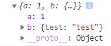
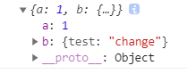
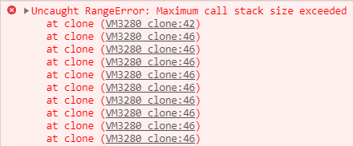
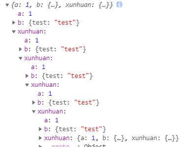

把一个对象复制给另一个对象，我们称之为拷贝。

> tip 注意
> 拷贝并非赋值

先来看看赋值操作。

```js
var obj = {
  a: 1,
  b: { test: 'test' }
};
var clone = obj; //直接赋值
obj.a = 2;
obj.b.test = 'change';
console.log(clone.a); // 2
console.log(clone.b); // {test: "change"}
console.log(obj === clone); // true
```

我们新建一个 `obj` ，作为例子，`clone` 通过赋值操作，但其实 `clone` 和 `obj` 引用的是同一个地址中的对象，所以我们一改变 `obj` ， `clone` 也跟着变，这并不算拷贝。

### 浅拷贝

拷贝是指从一个对象中，循环复制里面的属性给一个新对象，我们可以用 `Object.assign()` 来实现一个最简单的浅拷贝。

```js
var obj = {
  a: 1,
  b: { test: 'test' }
};
var copy = Object.assign({}, obj);
console.log(copy);
```



那为什么说它是浅拷贝呢？我们更改 obj 的值试试。

```js
obj.a = 2;
obj.b.test = 'change';
//再打印出 copy 看看
console.log(copy);
```



可以看到，变量 `a` 没有发生变化，而变量 `b` 里却发生了变化。之前堆栈中讲了，基本类型在栈中，拷贝时拷贝的是`值`，而对象类型拷贝时拷贝的是`地址`，所以只要地址链接的这个对象发生了变化，还是会影响到拷贝出来的新对象。

> `Object.assign()` 方法用于将所有可枚举属性的值从一个或多个源对象复制到目标对象。它将返回目标对象。

其实就是循环将一个对象的属性值拷贝给另一个对象，我们也可以自己写一个浅拷贝。

```js
var obj = {
  a: 1,
  b: { test: 'test' }
};
function clone(target) {
  let newObj = {};
  for (var key in target) {
    newObj[key] = obj[key];
  }
  return newObj;
}
var copy = clone(obj);
console.log(copy);
```

浅拷贝只是拷贝到基本类型，并不能真正拷贝引用类型。

### 深拷贝

若是要把引用类型也全都拷贝，那就要在拷贝的时候进行判断：如果碰到基本类型则直接拷贝，如果碰到对象类型，那就展开再循环拷贝一遍里面的属性，无限重复这个动作直到拷贝完成。

也就是使用递归函数来实现。

- 基础版

```js
//最简单的深拷贝
function clone(target) {
  if (typeof target === 'object') {
    let newObj = {};
    for (const key in target) {
      newObj[key] = clone(target[key]);
    }
    return newObj;
  } else {
    return target;
  }
}
```

当然，这是一个最简单的深拷贝，有很多的缺陷，比如说没有考虑到数组，我们修改一下代码，让它也能支持拷贝数组。

- 支持数组

```js
//深拷贝 支持数组
function clone(target) {
  if (typeof target === 'object') {
    let newObj = Array.isArray(target) ? [] : {};
    for (const key in target) {
      newObj[key] = clone(target[key]);
    }
    return newObj;
  } else {
    return target;
  }
}
```

- 支持循环引用

在对象的拷贝中，还有一种情况比较特殊，就是循环引用。
我们先来用上面的 clone 函数来拷贝一下下面这个例子：

```js
var obj = {
  a: 1,
  b: { test: 'test' }
};
obj.xunhuan = obj; //让obj的一个属性又链接到obj
var copy = clone(obj);
```



上面这个递归函数是不断的调用自身，循环进行属性的拷贝的，如果对象中的子属性又链接回来的话，会永远的循环下去，导致爆栈。

如何解决这个问题呢？

我们可以判断一下，如果是循环引用的话，就不要让它进入循环，任由它指向原先的地址。

```js
//深拷贝 支持循环引用
function clone(target, sign = {}) {
  if (typeof target === 'object') {
    let newObj = Array.isArray(target) ? [] : {};
    if (sign[target]) {
      return sign[target];
    }
    sign[target] = newObj;
    for (const key in target) {
      newObj[key] = clone(target[key], sign);
    }
    return newObj;
  } else {
    return target;
  }
}
```



### 参考

例子中的代码，我们只考虑了 `array` 和 `object` 这两种数据类型，其实还有更多的类型需要考虑，比如说 `Symbol` 、 `Date` 、 `Error` 。

对于**可遍历类型**和**不可遍历类型**，处理的方式是不一样的。
另外，还得考虑性能问题，要对代码的实现方式进行性能优化。

想要完全了解深拷贝，可以阅读 `lodash` 的拷贝实现源码，其中核心代码是 **baseClone.js**

- [lodash-cloneDeep.js](https://github.com/lodash/lodash/blob/master/cloneDeep.js)

### 常用的一些方法

**浅拷贝**

- Object.assign()
- ES6 解构赋值
- concat()
- slice()

**局限性**

- JSON.stringify() + JSON.parse()

使用该方法很大程度上等同于深拷贝，但也有缺陷：无法拷贝函数和原型链的属性和方法。且速度不算快。

```js
//示例代码
var obj = {
  name: 'xgq',
  other: {
    address: 'js'
  }
};
var arr = [999, { title: 'h1', value: 'hello' }];
var clone1 = Object.assign({}, obj);
var clone2 = JSON.parse(JSON.stringify(obj));
var clone3 = { ...obj };
var clone4 = arr.concat([]);
var clone5 = arr.slice();
```
