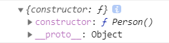
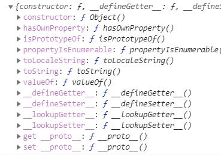

## 概念

```js
//构造函数
function Person(name, age) {
  this.name = name;
  this.age = age;
}
Person.prototype.test = 'test';
//创建实例
var xgq = new Person('xgq', 22);
//实例可以共享构造函数的属性
console.log(xgq.name); // 'xgq'
console.log(xgq.age); // 22
console.log(xgq.test); // 'test'
```

:::tip 构造函数与实例对象
在 JavaScript 中，用 `new` 关键字来调用的函数，称为 `构造函数`，而通过 `new` 关键字调用 `构造函数` 所生成的对象叫做 `实例对象`
:::

从以上代码我看可以看到，`Person`  是一个构造函数，`xgq`  则是一个实例对象，实例共享了构造函数中的  `name`  和  `age`  属性。而当我们去访问 `xgq.test` 时，也能访问到 `test` ，为什么呢？

实际上，我们在使用  `new`  操作符时，会将  xgq  的  `__proto__`  属性链接到构造函数  `Person`  的  `prototype`  上。

```js
xgq.__proto__ === Person.prototype; // true
```

当我们访问 `xgq.test`  首先会读取 `xgq` 这个对象的属性，如果没有这个属性则会通过 `__proto__` 找到这个对象的原型，也就是 `Person.prototype` 中寻找，于是找到了 `test` ，如果还是找不到，它会一层层往上查找，直到查找到该属性或者是到达最顶层 `Object` 的原型对象：`Object.prototype` 时才会停止。  
而一层层的查找方式就像一条铁链，一环接一环，所以我们把这个关系称之为原型链。

### constructor

我们先来单独理解一下 `constructor` 。

```js
function Person() {}
var person1 = new Person();
var person2 = new Person();
```

- `person1` 与 `person2` 是 `Person` 对象的实例，他们的 `constructor` 指向创建它们的构造函数，即 `Person` 函数。
- `Person` 是函数，但同时也是 `Function` 实例对象，它的 `constructor` 指向创建它的构造函数，即 `Function` 函数。
- 至于 `Function` 函数，它是 JS 的内置对象，在第一点我们就已经知道它的构造函数是它自身，所以内部 `constructor` 属性指向自己。

### 显式原型 `prototype`

> `prototype` 是一个显式原型属性，只有函数才拥有该属性

每个函数在创建后都会拥有一个名为 `prototype` 的属性，这个属性指向函数的原型对象。

> 通过 `Function.prototype.bind` 方法构造出来的函数是个例外，它没有 `prototype` 属性

声明一个函数

```js
function Person() {
  return 'im a person';
}
console.log(Person.prototype);
```



声明函数 `Person` 时，它自动创建了一个 `prototype` 指针（指向原型对象），而这个被指向的原型对象自动获得了一个 `constructor` （构造函数），并且 `constructor` 指向的就是 `Person` 。

> 一个函数的原型对象的构造函数就是这个函数本身

`Person.prototype.constructor === Person`

上面的声明函数几乎等同于下面代码：

```js
// 使用Function构造器创建Function对象
var Person = new Function('...');
// 唯一的区别是：这种方式生成的函数是匿名函数[anonymous]，并且只在真正调用时才生成对象模型。
```

> 这也就是我们所说的：函数即对象

### 隐式原型 `proto`

> 其实这个属性指向了 `[[prototype]]`，但是 `[[prototype]]` 是内部属性，我们并不能访问到，所以使用 `__proto__` 来访问。

`__proto__` 指向了创建该对象的构造函数的显式原型。



我们发现这个 `__proto__` 指向的是 `Object.prototype`。

`__proto__` 这个属性很关键，它指向该对象所属的构造函数，使得对象可以通过该属性找到自己的所属。
