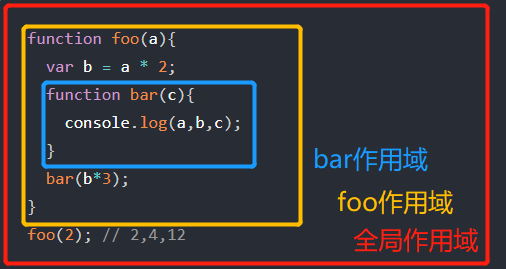

首先介绍三个概念：

- **引擎**：从头到尾负责整个 JavaScript 程序的编译以及执行过程。
- **编译器**：负责语法分析及代码生成工作。
- **作用域**：负责收集并维护由所有声明标识符组成的一系列查询，用非常严格的规则，确定当前执行的代码对这些标识符的访问权限。

## 编译原理

`JavaScript` 是一门编译语言，但与传统的编译语言不同，它不是提前编译的，编译的结果也不能在分布式系统中进行移植，程序中的一段代码在执行之前会经历三个步骤，统称为 `编译`。

1. 分词/词法分析

我们的代码对`JavaScript`引擎来说就是一段冗长的字符串，这个过程会将你写的代码分解成有意义的代码块。例如： `var a = 2` --> `var 、a 、 = 、 2`，空格是否会被当做词法单元，取决于空格在这门语言中是否具有意义。

2. 解析/语法分析

这个过程会将词法单元流（数组）转换成由程序语法结构树。称为 `“抽象语法树”` （AST） 。

3. 代码生成

最后将 AST 转换为可执行代码，这个过程与语言、目标平台等息息相关。到这一步， `var a = 2` 这段代码才会真正的做出行为：创建一个变量，命名为 `a`（包括分配内存等行为），并将 `2` 这个值储存在 `a` 中。

## 编译器

代码生成后，编译器就起到了至关重要的作用。这里最重要的两个概念是 `LHS` 和 `RHS` 。

一个不严谨的解释：当变量出现在赋值操作的左侧时进行 `LHS` 查询，出现在右侧时进行 `RHS` 查询。

> LHS 查询和 RHS 查询的含义是"赋值操作的左侧和右侧"，并不一定是意味着是" = 赋值操作符的左侧和右侧"。赋值操作还有其他几种形式，因此在概念上最好将其理解为"赋值操作的目标是谁（LHS）"以及"谁是赋值操作的源头（RHS）"。——《你不知道的 JavaScript》

```js
function foo(a) {
  var b = a;
  return a + b;
}
var c = foo(2);
```

- LHS

对于 `var b = a` 这段代码，JavaScript 引擎会为变量 b 进行 `LHS` 查询，为变量 `b` 找到 `a` 进行赋值。

如果理解不了的话，可以把 LHS 理解为写入内存。

执行的 `LHS` 查找：`c=, a=2(隐式变量分配), b=`

- RHS

对于 `var c = foo(2)`，变量 `c` 进行一次 LHS 查询，foo 函数中则是 `RHS` ，找出 `a` 。

如果理解不了的话，可以把 RHS 理解为从内存中读取。

执行的 `RHS` 查找：`读取foo,= a, a ,b`

## 全局作用域

声明在任何函数之外的顶层作用域中的变量，就是全局变量。

可以通过 `window` 这个关键字进行访问。

```js
var a = 666;
function test() {
  console.log(a); // 666
  console.log(window.a); // 666
}
test();
```

当然，也可以用 `window` 这个关键字声明，而且用这种方式，可以在代码的任何位置进行声明。

```js
function test() {
  window.a = 666;
  console.log(a); // 666
}
test();
console.log(window.a); // 666
```

## 词法作用域

```js
function foo(a) {
  var b = a * 2;
  function bar(c) {
    console.log(a, b, c);
  }
  bar(b * 3);
}
foo(2); // 2,4,12
```

这个例子中，有三个逐级嵌套的作用域。词法作用域的意思就是从代码书写时，函数与变量声明的位置就已经决定了它们各自的作用域，所以词法作用域是静态的作用域。



我们可以看到最里面的 `bar` 中除了接收到参数 `c` 以外，并没有 `a` 与 `b` 这两个变量，但是它依然能访问到它们。

它们的查找规则为向外查找， `bar` 中没有 a 和 b 这两个变量，那就往上找，包裹着它们的是 `foo` 函数，所以就在 `foo` 函数里查找这两个变量，找到一个 `b` 变量，但 `b` 是由 `a` 进行计算获得的，那就再往上找，`foo` 的外面就是全局作用域了，代码也就是在这里将 `2` 作为 `a` 传入 `foo` 的。

## 函数作用域和块作用域

`JavaScript` 通过函数来管理作用域，在函数内部声明的变量只能在函数内部进行使用。（有一个例外，那就是闭包）

```js
//函数作用域
(function () {
  var xgq = 'xgq';
})();
console.log(xgq); // Uncaught ReferenceError: xgq is not defined
```

我们在函数中声明一个变量 `xgq`，在函数外进行访问，就会报错。

```js
//块级作用域
if (true) {
  var xgq = 'xgq';
}
console.log(xgq); // 'xgq'
```

而块级作用域则无区别。
