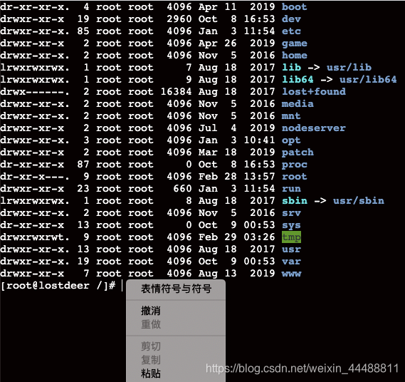

# xterm.js 实现复制粘贴

支持 **右键粘贴** 和 **快捷键粘贴**



## 1.修改源码

在 `xterm/typings/xterm.d.ts` 文件中增加一行代码，让其支持 `onpaste` 事件，并能正确传递参数。

```js
on(type: 'paste', listener: (event: KeyboardEvent) => void): void;
```

## 2.配置 xtem.js

```js
var terminal = new Terminal({
	...
});
// onpaste事件
terminal.on('paste', function (text) {
	console.log('剪贴板中的值',text)；
})
```
