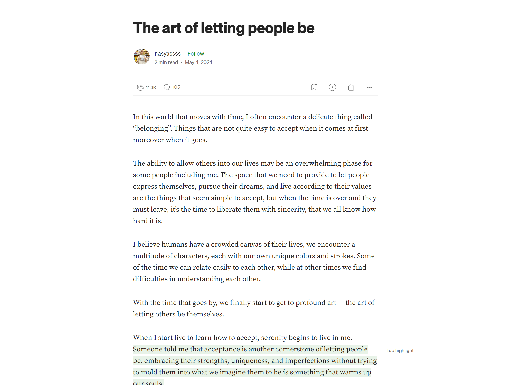
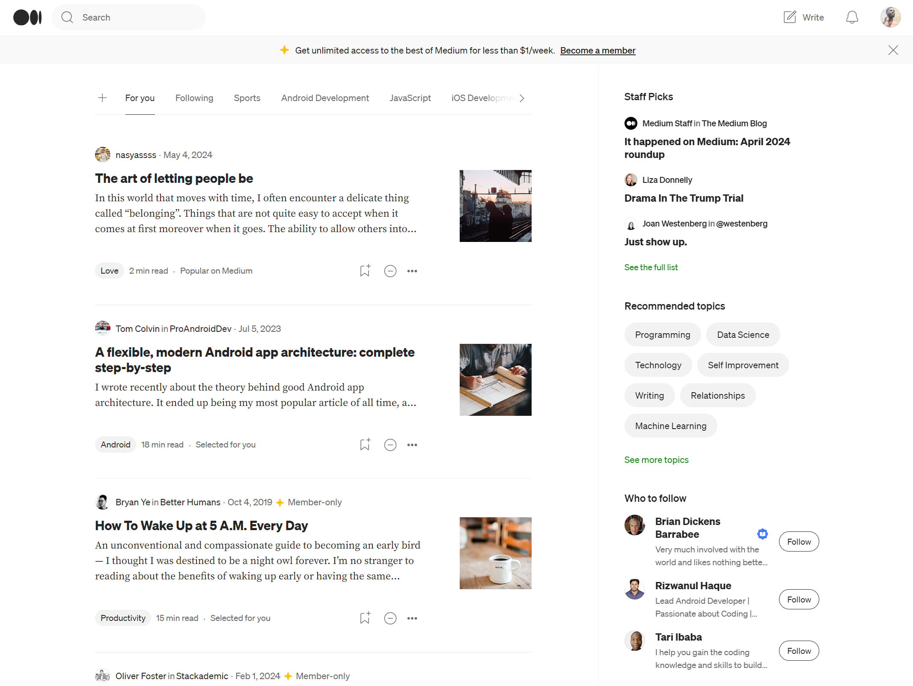

<style >
.btn-nostyle {
    appearance: auto;
    font-style: ;
    font-variant-ligatures: ;
    font-variant-caps: ;
    font-variant-numeric: ;
    font-variant-east-asian: ;
    font-variant-alternates: ;
    font-variant-position: ;
    font-weight: ;
    font-stretch: ;
    font-size: ;
    font-family: ;
    font-optical-sizing: ;
    font-kerning: ;
    font-feature-settings: ;
    font-variation-settings: ;
    text-rendering: auto;
    color: buttontext;
    letter-spacing: normal;
    word-spacing: normal;
    line-height: normal;
    text-transform: none;
    text-indent: 0px;
    text-shadow: none;
    display: inline-block;
    text-align: center;
    align-items: flex-start;
    cursor: default;
    box-sizing: border-box;
    background-color: buttonface;
    margin: 0em;
    padding-block: 1px;
    padding-inline: 6px;
    border-width: 2px;
    border-style: outset;
    border-color: buttonborder;
    border-image: initial;
}
</style>

# CSS

前面我们已经会了一个简单的 `HTML` 了，主要内容是一篇文章。

不过我相信，你在网上浏览的各种网页都是非常漂亮的，即便它是一篇简单的文章，也会像下面这样。



更不乏这样的页面。



而我们那个简单的 `HTML` 则缺少这些精美的样式，要给 `HTML` 加上各种样式，我们就需要用到 `CSS` 了。

**首先我们先学习一下怎么给刚刚那个页面加一点样式**

## CSS 的行内样式

最简单的方法就是直接在标签中添加 `style` 属性，比如：

把 `div` 中的内容变成红色

```html
<div style="color: red;">内容</div>
```

把 `div` 中的内容的字体大小变成 20 像素

```html
<div style="font-size: 20px;">内容</div>
```

如果有多个样式的话，就用`;`隔开

```html
<div style="font-size: 20px;color: red;">内容</div>
```

所以你需要先知道一些 `CSS 的属性`，这样才能开始添加基本样式，之后再学习更多。

### 我们先来实操一下，怎么给一个按钮添加样式。

先看看最原始的 `button` 长什么样

<button class="btn-nostyle">按钮</button>

然后我们把它美化一下，让它变的好看。

**首先我们把它的内边距变大、边框去掉、添加一个背景色。**

```html
<button style="padding: 10px 20px;border: none;background-color: #1772f6;">
  按钮
</button>
```

<button class="btn-nostyle" style="padding: 5px 10px;border: none;background-color: #1772f6;">
  按钮
</button>

可以看到添加了背景色之后，和文字本身的颜色有点冲突了，看不清字，而且按钮棱角分明，不是很优雅。

**我们可以把文字颜色改成白色，然后让四个角都变成圆润的角。**

我们需要用 `color` 修改字体颜色，`border-radius` 属性修改圆角。

```html
<button
  style="padding: 10px 20px;border: none;background-color: #1772f6;color: #fff; border-radius: 10px;"
>
  按钮
</button>
```

<button class="btn-nostyle" style="padding: 10px 20px;border: none;background-color: #1772f6;color: #fff; border-radius: 10px;">按钮</button>

**现在看起来很不错啦，和原始的样式放在一起对比一下吧！**

<button class="btn-nostyle">按钮</button>
<button class="btn-nostyle" style="margin-left: 20px;padding: 10px 20px;border: none;background-color: #1772f6;color: #fff; border-radius: 10px;">按钮</button>

### 然后我来介绍一下我们用到的这些属性。

#### `padding`：内边距

- 语法：`padding: [top] [right] [bottom] [left];`
- `[top]`, `[right]`, `[bottom]`, `[left]`分别表示上、右、下、左四个方向的内边距大小。
- 每个方向的内边距大小可以是像素值、百分比，也可以是预定义的值（如`inherit`、`initial`、`unset`等）。

`padding: 10px 20px 10px 20px;` 可以写成 `padding: 10px 20px;`，因为它上下是一样的 10 像素，左右也一样 20 像素，就可以采用这样的简化写法。

`padding: 10px 10px 10px 10px;` 可以写成 `padding: 10px;`，因为它四个都一样，就可以简化成这样。

#### `border`：边框

- 语法：`border: [border-width] [border-style] [border-color];`
- `[border-width]`: 定义边框的宽度，可以是像素值、百分比或预定义的值（如 thin、medium、thick）。
- `[border-style]`: 定义边框的样式，常见的样式包括 solid（实线）、dashed（虚线）、dotted（点线）等。
- `[border-color]`: 定义边框的颜色，可以是颜色名称、十六进制值或 RGB 值。

#### `background-color`：背景颜色

- 语法：`background-color: [color];`
- `[color]`可以是颜色名称、十六进制值或 RGB 值。

#### `color`：文字颜色

- 语法：`color: [color];`
- `[color]`可以是颜色名称、十六进制值或 RGB 值。

#### `border-radius`：边框圆角

- 语法：`border-radius: [value];`
- `[value]`可以是像素值、百分比或预定义的值。

## CSS 内部样式

刚刚我们学会了用 `style` 给标签添加了样式。

```html
<div
  style="
        height: 200px;
        width: 200px;
        color: white;
        background-color: black;
        border: 1px solid red;
        border-radius: 5px;
        align-items: center;
      "
>
  内容内容内容内容内容内容内容内容内容内容内容内容内容内容内容内容内容内容内容内容内容内容内容内容内容内容内容内容内容
</div>
```

你会发现这种写法，在样式少的情况下还好，一旦样式多起来，实在是太冗长了，样式一多，代码都挤在一起，非常混乱，那我想写的清晰一些怎么办呢，这时候我们就要用别的写法了。

### style 标签

首先在 `head` 标签中添加一个 `style` 标签，然后把样式写在 `style` 标签中。

```html
<html>
  <head>
    <meta charset="UTF-8" />
    <title>标签名字</title>
    <style>
      h1 {
        color: red;
      }
      p {
        color: green;
        background-color: black;
      }
    </style>
  </head>
  <body>
    <h1>标题</h1>
    <h2>小标题</h2>
    <p>段落1</p>
    <p>段落2</p>
  </body>
</html>
```

我们在 `style` 中写了 `h1` 标签和 `p` 标签的样式，但是现在存在一个新的问题，两个 `p` 标签的样式都被改成一样了

我现在希望段落 1 文字颜色是绿色，而段落 2 文字颜色是蓝色，怎么办呢？

接下来我们就需要一个标签的属性：`class`，给两个 `p` 标签分别设置不同的 `class` 属性，然后分别设置不同的样式。

```html
<html>
  <head>
    <meta charset="UTF-8" />
    <title>标签名字</title>
    <style>
      .p1 {
        color: green;
        background-color: black;
      }
      .p2 {
        color: blue;
        background-color: black;
      }
    </style>
  </head>
  <body>
    <h1>标题</h1>
    <h2>小标题</h2>
    <p class="p1">段落1</p>
    <p class="p2">段落2</p>
  </body>
</html>
```

## CSS 外部样式

其实就是把 `style` 中的 css 样式放到一个单独的 css 文件中，然后通过 `link` 标签引入到 html 文件中。

- style.css

```css
.p1 {
  color: green;
  background-color: black;
}
.p2 {
  color: blue;
  background-color: black;
}
```

- index.html

```html
<html>
  <head>
    <meta charset="UTF-8" />
    <title>标签名字</title>
    <link rel="stylesheet" href="./style.css" />
  </head>
  <body>
    <h1>标题</h1>
    <h2>小标题</h2>
    <p class="p1">段落1</p>
    <p class="p2">段落2</p>
  </body>
</html>
```
