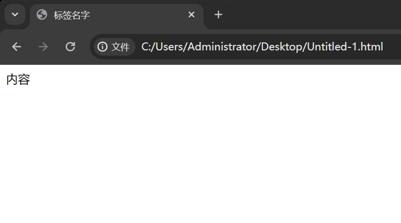

<style >
.stackblitz {
  width: 100%;
  height: 500px;
  border: 1px solid #ccc;
}
</style>

# HTML

一个最简单的网页就是一个格式为.html 的文件，它可以被浏览器打开。
我们来看一个最简单的 html 文件里面写了什么。

```html
<html>
  <head>
    <meta charset="UTF-8" />
    <title>标签名字</title>
  </head>
  <body>
    内容
  </body>
</html>
```

然后用浏览器去打开它，就会是这个样子。



在线代码示例

<iframe class="stackblitz" src="https://stackblitz.com/edit/stackblitz-starters-mshorx?embed=1&file=index.html&hideNavigation=1" />

可以看到 `head` 中的 `title` 表示的是标签的名字，而 `body` 里面装的是网站的内容
这个时候我们就可以在里面写一些东西了，比如说写一篇文章。

```html
<html>
  <head>
    <meta charset="UTF-8" />
    <title>标签名字</title>
  </head>
  <body>
    标题 小标题
    文章内容文章内容文章内容文章内容文章内容文章内容文章内容文章内容文章内容文章内容
  </body>
</html>
```

但是文字都挤在了一起，我想让它们一行一行显示怎么做呢？
可以使用`<br></br>`标签来换行。

```html
<html>
  <head><meta charset="UTF-8" />
    <title>标签名字</title>
  </head>
  <body>
    标题<br></br>小标题<br></br>文章内容文章内容文章内容文章内容文章内容文章内容文章内容文章内容文章内容文章内容
  </body>
</html>
```

这也仅仅是一行一行显示而已，怎么把它们全部重新排版一下呢？

```html
<html>
  <head>
    <meta charset="UTF-8" />
    <title>标签名字</title>
  </head>
  <body>
    <h1>标题</h1>
    <h2>小标题</h2>
    <p>
      文章内容文章内容文章内容文章内容文章内容文章内容文章内容文章内容文章内容文章内容
    </p>
  </body>
</html>
```

<iframe class="stackblitz" src="https://stackblitz.com/edit/stackblitz-starters-ulgym2?embed=1&file=index.html&hideNavigation=1" />

像`h1` `h2` `p` 这些把内容包起来的东西叫 `html 标签`，你可以用不同功能的标签来放置不同类型的内容，`html 标签`有很多，以下是一些常用的标签:

- `div`
- `span`
- `img`
- `a`
- `br`

这里是更多 html 的各种标签，可作了解:
[HTML 标签集](./html-tag.md)
