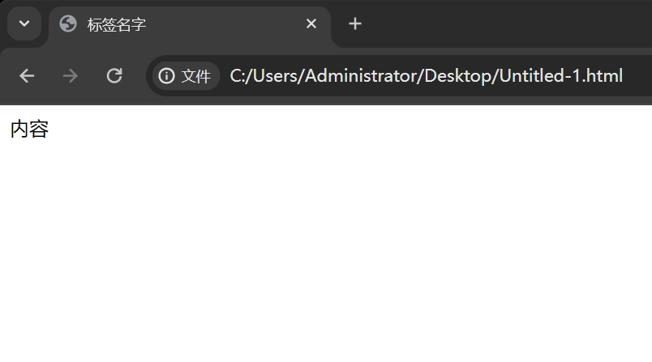

# HTML

一个最简单的网页就是一个格式为.html 的文件，它可以被浏览器打开。
我们来看一个最简单的 html 文件里面写了什么。

```html
<html>
  <head>
    <title>标签名字</title>
  </head>
  <body>
    内容
  </body>
</html>
```

然后用浏览器去打开它，就会是这个样子。



可以看到 `head` 中的 `title` 表示的是标签的名字，而 `body` 里面装的是网站的内容
