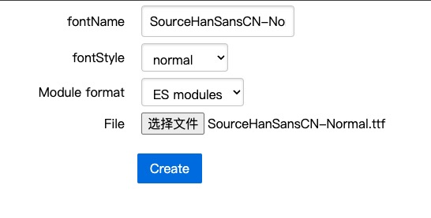

<style >
.pdf-iframe {
  width: 100%;
  height: 500px;
  border: 1px solid #ccc;
}
</style>

# PDF

前端关于 PDF 的需求，一般分几种情况：

1. 已经有了 PDF 文件，只是在页面上做个展示

[直接展示 PDF 文件](#t1)

2. 已经有了 PDF 文件，但不仅要在网页上进行展示，还需要二次编辑，比如说在原本的 PDF 上添加文字、图片、甚至盖个章等等

[通过 PDF.js 实现](#t2)

3. 没有 PDF 文件，需要前端动态生成 PDF 文件

[通过 jspdf 实现](#t3)

4. 没有 PDF 文件，需要前端把某个页面转换成 PDF 文件

[通过 html2canvas + jspdf 实现](#t4)

## 直接展示{#t1}

不论是用户上传的，还是后端生成的，即文件已经存在于服务器上，有文件地址：`http://xxx.pdf`，通常这种情况，浏览器可以直接对其进行展示。

```html
<a target="_blank" href="http://xxx.pdf">跳转到 pdf</a>
```

```ts
window.open('http://xxx.pdf');
```

<a target="_blank" href="https://mozilla.github.io/pdf.js/web/compressed.tracemonkey-pldi-09.pdf">点击直接打开 pdf</a>

**不想跳转，可使用 iframe 嵌套，直接在当前页显示**

```html
<iframe src="http://xxx.pdf" />
```

<iframe class="pdf-iframe" src="https://mozilla.github.io/pdf.js/web/compressed.tracemonkey-pldi-09.pdf" />

## PDF.js{#t2}

## jspdf{#t3}

> 前端生成 PDF 文件

::: code-group

```bash [npm]
npm install jspdf
```

```bash [pnpm]
pnpm install jspdf
```

```bash [yarn]
yarn add jspdf
```

```bash [bun]
bun add jspdf
```

:::

**生成一个 PDF 文件并下载**

```ts
const doc = new jspdf('p', 'pt', 'a4'); // 首先初始化一个pdf文档
doc.text('第一页内容', 20, 20); // 添加文字 20,20 是坐标
doc.addPage('a4', 'l'); // 添加页面
doc.text('第二页内容', 20, 20); // 添加文字
doc.addImage(
  'https://avatars.githubusercontent.com/u/33191843',
  'JPEG',
  20,
  30,
  200,
  200
); // 添加图片
doc.save('example.pdf'); // 下载pdf
```

详细使用说明参考文档

- [jspdf 文档 1](https://raw.githack.com/MrRio/jsPDF/master/docs/index.html)
- [jspdf 文档 2](https://parallax.github.io/jsPDF/docs/index.html)

### jspdf 中文乱码问题

如果 pdf 内容有中文，那就会乱码，需要设置中文字体，具体操作如下：

1.  首先下载字体

[下载思源字体](https://github.com/Pal3love/Source-Han-TrueType/releases/download/2.004-2.002-1.002-R/SourceHanSansCN.zip)

2.  把 ttf 字体文件转换成 js 或 ts 文件

[在线转换网址](https://rawgit.com/MrRio/jsPDF/master/fontconverter/fontconverter.html)



这里用 normal 字体举例，点击 Create 转换，完成后，fontName 会显示一个字体名，你需要复制它，等会会用到

然后会自动下载一个 js 文件，如果你是 typescript 项目，需要把 js 后缀改成 ts。

在我给的例子里，转换后的 fontName 是`SourceHanSansCN-Normal`，下载的文件名是`SourceHanSansCN-Normal-normal.js`，因为我是 typescript 项目，所以我把文件名改成了`SourceHanSansCN-Normal-normal.ts`

把这个 ts 文件放进项目里，修改代码：

```ts
import './SourceHanSansCN-Normal-normal.ts'; // [!code focus] // 能引用到就行
```

```ts
const doc = new jspdf('p', 'pt', 'a4'); // 首先初始化一个pdf文档
doc.setFont('SourceHanSansCN-Normal'); // [!code focus] // 这里填的是刚刚的fontName
doc.text('第一页内容', 20, 20); // 添加文字 20,20 是坐标
doc.addPage('a4', 'l'); // 添加页面
doc.text('第二页内容', 20, 20); // 添加文字
doc.addImage(
  'https://avatars.githubusercontent.com/u/33191843',
  'JPEG',
  20,
  30,
  200,
  200
); // 添加图片
doc.save('example.pdf'); // 下载pdf
```

## html2canvas + jspdf{#t4}

> 前端把某个页面转换成 PDF 文件

这其实思路就是截图，然后把图片放进 pdf，最后下载。
可以看这篇文章：[截图](./screenshot)

**代码示例**

```ts
const div = document.getElementById('screenshot');
html2canvas(div).then(function (canvas) {
  const dataURL = canvas.toDataURL('image/png', 1);
  const doc = new jspdf('p', 'pt', 'a4'); // 首先初始化一个pdf文档
  doc.addImage(dataURL, 'JPEG', 20, 30, 200, 200); // 添加图片
  doc.save('example.pdf'); // 下载pdf
});
```
