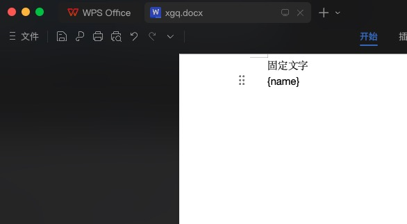

<style>
.stackblitz {
  width: 100%;
  height: 500px;
  border: 1px solid #ccc;
}
</style>

# Office Word

前端关于 Word 的需求，一般分几种情况：

1. 已经有了 Word 文件，只是在页面上做个展示

- [通过 docx-preview 实现](#t1)
- [通过 mammoth 实现](#t2)

2. 没有 Word 文件，需要前端动态生成 Word 文件

这里也分两种形式：

- 一种是：通过一个模板 Word 文件，通过填入模板中的变量，生成 Word 文件

[通过 docxtemplater + pizzip 实现](#t3)

- 另一种是：直接通过某个页面转换成 Word 文件

[通过 html-docx-js 实现](#t4)

## docx-preview{#t1}

::: code-group

```bash [npm]
npm install docx-preview
```

```bash [pnpm]
pnpm install docx-preview
```

```bash [yarn]
yarn add docx-preview
```

```bash [bun]
bun add docx-preview
```

:::

```ts
import { renderAsync } from 'docx-preview';
import docx from './xgq.docx';
```

```html
<div id="preview"></div>
```

```ts
const docxData = await fetch(docx); // 这里展示的情况是word文件在本地
const arrayBuffer = await docxData.arrayBuffer();
renderAsync(arrayBuffer, document.getElementById('preview') as any, undefined, {
  inWrapper: false,
  ignoreWidth: true,
});
```

## mammoth{#t2}

::: code-group

```bash [npm]
npm install mammoth
```

```bash [pnpm]
pnpm install mammoth
```

```bash [yarn]
yarn add mammoth
```

```bash [bun]
bun add mammoth
```

:::

```ts
import mammoth from 'mammoth';
import docx from './xgq.docx';
```

```html
<div id="preview"></div>
```

```ts
const docxData = await fetch(docx); // 这里展示的情况是word文件在本地
const arrayBuffer = await docxData.arrayBuffer();
const html = await mammoth.convertToHtml({ arrayBuffer });
document.getElementById('preview').innerHTML = html.value;
```

## docxtemplater + pizzip{#t3}

::: code-group

```bash [npm]
npm install docxtemplater pizzip
```

```bash [pnpm]
pnpm install docxtemplater pizzip
```

```bash [yarn]
yarn add docxtemplater pizzip
```

```bash [bun]
bun add docxtemplater pizzip
```

:::

**首先需要一个 docx 文件作为模板：`xgq.docx`**



`{}`语法代表变量

```ts
import docxtemplater from 'docxtemplater';
import pizzip from 'pizzip'; // 必须
import docx from './xgq.docx';
import { saveAs } from 'file-saver';
```

```ts
const docxData = await fetch(docx); // 这里展示的情况是word文件在本地
const arrayBuffer = await docxData.arrayBuffer();
const zip = new pizzip(arrayBuffer); // 必须用pizzip生成zip
const doc = new docxtemplater(zip, {
  paragraphLoop: true,
  linebreaks: true,
});
doc.render({
  name: 'xgq',
});
const blob = doc.getZip().generate({
  type: 'blob',
  mimeType:
    'application/vnd.openxmlformats-officedocument.wordprocessingml.document',
});
saveAs(blob, 'download.docx');
```

**代码示例**

<iframe class="stackblitz" src="https://stackblitz.com/edit/vitejs-vite-adh4as?embed=1&file=src%2Fmain.tsx&hideNavigation=1" />

## html-docx-js{#t4}

::: code-group

```bash [npm]
npm install html-docx-js
```

```bash [pnpm]
pnpm install html-docx-js
```

```bash [yarn]
yarn add html-docx-js
```

```bash [bun]
bun add html-docx-js
```

:::

```ts
import * as htmlDocx from 'html-docx-js/dist/html-docx';
```

```ts
const html = `
<html>
<body>内容</body>
</html>
`;
const converted = await htmlDocx.asBlob(html, {
  orientation: 'portrait',
  margins: {
    top: 500,
    left: 500,
    right: 500,
    bottom: 500,
  },
});
saveAs(converted, 'download.docx');
```

### 不支持严格模式

比如你在 vite 中使用`html-docx-js`
::: danger 报错
with(obj){}...
:::

主要是因为这个 js 库太老了，写法不支持严格模式，所以需要修改源码，将`with`用法替换掉。

可以直接看下方的代码示例，里面的`html-docx-js`是修改过源码后的。

**代码示例**

<iframe class="stackblitz" src="https://stackblitz.com/edit/vitejs-vite-vvkayg?embed=1&file=src%2Fmain.tsx&hideNavigation=1" />
